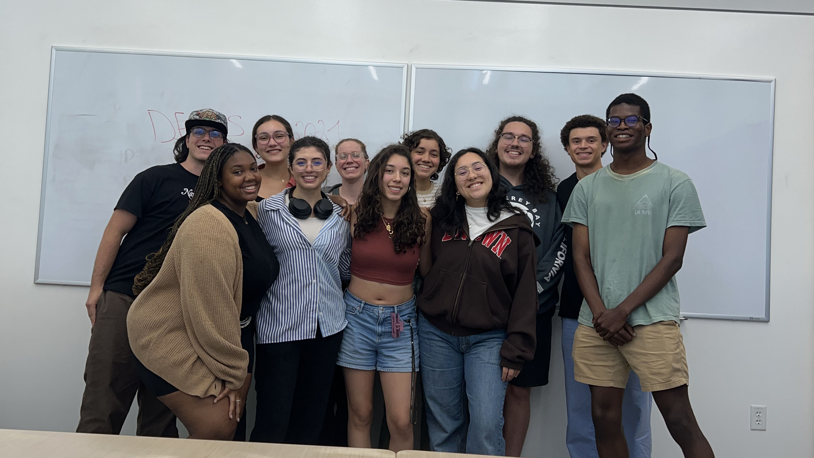

This is an item in your portfolio. It can be have images or nice text.

    
    

        
This is the first paragraph. It contains some introductory text that provides context for the image next to it.

    

    
    

        
This is the second paragraph. Here we discuss more details, adding depth to the content alongside the accompanying image.

    

    
    

        
This is the third paragraph. Additional information is presented here, elaborating on the topic introduced earlier.

    

    
    

        
This is the fourth paragraph. Finally, we wrap up the discussion, summarizing key points and conclusions.

    

